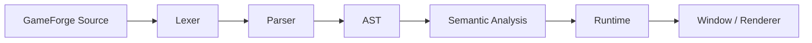

<div align="center">


### 🎮 A general-purpose programming language and engine for building games


<br/>


<br/>

<a href="https://github.com/Ombryal/GameForge">

</a>

</div>

---

## 🚀 What is GameForge?

GameForge is a language, compiler, and runtime for building games without hardcoding one genre's assumptions into the engine. Platformers, RPGs, strategy games, shooters, and everything else are meant to come out of the same small set of primitives — entities, components, systems, events — instead of the engine shipping a `RacingCar` type for one genre and nothing for the rest.

```gf
speed = 250
total = speed + 10
```

Right now that's genuinely all the language can parse and validate — a plain assignment and addition. It's compiled through the real pipeline: lexed into tokens, parsed into an AST, and checked for undefined identifiers before anything runs.

```bash
cargo test --workspace
```

---

## 🎬 Where the language is headed

```gf
entity Player {
    transform
    sprite = asset("player.png")
    speed: Float = 250
}

system PlayerMovement {
    update(player: Player) {
        axis = input.axis("move")
        player.transform.position.x += axis.x * player.speed * delta
    }
}
```

> [!NOTE]
> Entities, systems, assets, and scenes above are the target syntax. The current compiler only understands plain assignment and addition — the lexer, parser, and AST don't have entity or system grammar yet.

---

## ✨ Features

### ✅ Current

- Lexer with source spans on every token
- Recursive descent parser (assignment, addition)
- AST covering the expressions the parser actually produces
- Semantic pass that catches undefined identifiers before they'd fail at runtime
- Runtime crate with a fixed-timestep tick driver (headless, no window yet)
- Small math crate (Vec2) with room to grow into 3D types later
- Every crate has its own unit tests

### 🔮 Planned

- 🧩 Entities, components, systems, and events in the language itself
- 🪟 Windowing and a 2D renderer
- 🧵 Bytecode / IR so the runtime can evolve without breaking syntax
- 🛠️ CLI (`new`, `dev`, `build`, `check`, `test`)
- 🖼️ Sprites, animation, collision, cameras
- 🔊 Audio, particles, UI primitives
- 📦 Project/package format and asset pipeline
- 🧊 3D renderer and scene model
- 🌐 Client/server networking
- 🖌️ Graphical editor

---

## 🏗️ Architecture



`Window / Renderer` is the next unimplemented stage — the runtime currently drives ticks headlessly with no platform backend attached.

---

## 📁 Project Structure

```text
GameForge/
├── crates/
│   ├── lexer/
│   ├── parser/
│   ├── ast/
│   ├── semantic/
│   ├── runtime/
│   └── math/
├── Cargo.toml
├── LICENSE
└── README.md
```

More crates (`ecs`, `renderer2d`, `platform`, `cli`) get added as the corresponding systems are actually implemented, not ahead of time.

---

## 🧰 Requirements

- Rust (stable toolchain)
- Cargo (ships with Rust)

No other dependencies — every crate so far is standard-library only.

## 🛠️ Build

```bash
git clone https://github.com/Ombryal/GameForge.git
cd GameForge

cargo build
cargo test --workspace
```

---

## 🛣️ Roadmap

```text
Language core
      ↓
Runtime + window
      ↓
2D vertical slice
      ↓
Developer tooling (CLI)
      ↓
Engine systems (physics, audio, animation, UI)
      ↓
Packaging + cross-platform builds
      ↓
3D foundation
      ↓
Ecosystem (editor, packages, plugins)
```

---

## 🤝 Contributing

GameForge is early and the language will keep changing shape as more of it gets implemented. Issues, ideas, and pull requests are welcome.

---

## 📜 License

GameForge is released under the **MIT License**. See [`LICENSE`](LICENSE).

<div align="center">

<br/>


### 🎮 GameForge

**Forge your game.**

[⭐ Star](https://github.com/Ombryal/GameForge)
&nbsp; • &nbsp;
[🐛 Issues](https://github.com/Ombryal/GameForge/issues)

</div>
